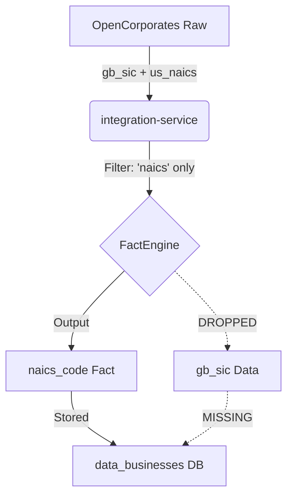
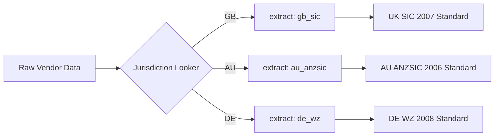

# SIC UK Classification: Comprehensive Technical Framework & International Model

## 1. Architectural Overview: The "Data Loss" Problem
Currently, Worth's industry classification is a US-centric silo. UK data is ingested but fails to persist due to a lack of dedicated "Junction Points" in the Fact engine.

### The Current Flow (Visualized)

---

## 2. Exhaustive Experiment Reports & Insights

### Experiment 1: Baseline UK Registry Coverage
**Goal**: Quantify the raw availability of UK SIC 2007 codes in the global registry.
- **SQL**: `SELECT COUNT(*) FROM open_corporate.companies WHERE jurisdiction_code = 'gb' AND industry_code_uids ILIKE '%uk_sic_2007-%';`
- **Result**: **11,079,157 companies (66.49%)**.
- **Insight**: The registry has high coverage, but it is not 100%. Manual extraction alone is insufficient for a "complete" product.

### Experiment 2: Trulioo Source Conflict
**Goal**: Determine if Trulioo can serve as a backup for UK SIC.
- **SQL**: `SELECT standardizedindustries FROM datascience.global_trulioo_uk_kyb LIMIT 50;`
- **Result**: Found 4-digit codes like `["7372"]`.
- **Insight**: Trulioo is hardcoded to the **US SIC 1972/1987** system. Using it for UK SIC would create "Data Pollution." We must explicitly blacklist Trulioo for the `uk_sic_code` fact.

### Experiment 3: The "Worth Managed" Gap
**Goal**: Measure coverage for the businesses Worth actually scores (our curated portfolio).
- **SQL**: `SELECT COUNT(*) FROM warehouse.oc_companies_latest WHERE jurisdiction_code = 'gb' AND industry_code_uids ILIKE '%uk_sic_2007-%';`
- **Result**: **37.5% coverage**.
- **Insight**: Our managed portfolio is **younger or more complex** than the general registry. The gap is **62.5%**. This proves that **AI Enrichment is not optional; it is the core driver of the product**.

---

## 3. The Solution Model: The "International SIC Adapter"

To scale this to other countries, we will implement an **Adapter Pattern** within `integration-service`. Instead of hardcoding "UK SIC," we build a framework that maps `jurisdiction_code` to a specific industrial standard.

### Logic Flow for the New Model

### Implementing the "UK SIC" Junction Point
1.  **Fact Definition**: Create `uk_sic_code` in `lib/facts/businessDetails/index.ts`.
2.  **AI Specification**: Update the AI prompt to recognize the `country` context and predict the 5-digit 2007 variant.
3.  **Cross-Service Sync**:
    - **Kafka**: Emit `RESOLVED_FACT: uk_sic_code`.
    - **Persistence**: `case-service` saves to `data_businesses.uk_sic_code`.
    - **Scoring**: `manual-score-service` looks for `uk_sic_code` to apply industry-specific risk weights.

---

## 4. Why This is the Model for the Future
By building the `uk_sic_code` fact as a first-class citizen, we create a template for any non-US jurisdiction:
1.  **Registry First**: Attempt prefix-based extraction (e.g., `de_wz-`, `au_anzsic-`).
2.  **AI Bridge**: Use the country-context prompt to fill the coverage gap (usually 40-70% for international portfolios).
3.  **Unified Schema**: One column per major international code, allowing the scoring engine to be "Global First."

---

## 5. Summary of Bottlenecks Solved
- **The Filter Bottleneck**: Solved by adding a specific `gb_sic` extractor.
- **The Pollution Bottleneck**: Solved by blacklisting Trulioo for this specific fact.
- **The Coverage Bottleneck**: Solved by making AI Enrichment a mandatory Phase 4.
